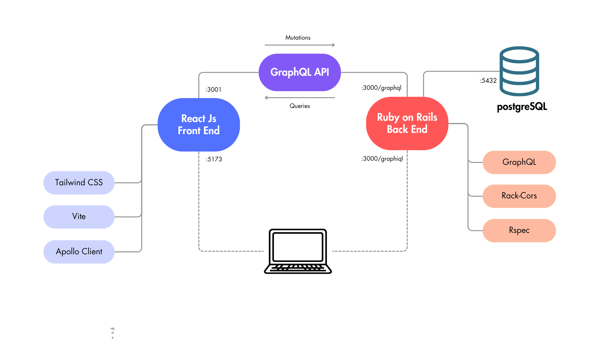

# 🚴 Marcus Shop – Custom Product App

We sell customizable bikes! 🛠️  
Try the live demo [here](https://5ae1-37-223-100-58.ngrok-free.app/).

---

## 🐳 Quick Start with Docker

```bash
git clone https://github.com/jordi-bird/marcus-shop.git
cd marcus-shop
docker-compose up --build
```


Alternatively you can configure locally, with ruby 3.2.2, rails 8.0.2 and react ^19.1. Run ./backend/setup_db.sh in order to create postgreSQL database.

## 🧠 Abstract


This project details the analysis and implementation of a scalable environment for product customization, based on a collection of existing options. Each option may behave differently depending on other selections via a set of predefined rules.

To support a consistent and flexible structure, the product (defined as `Item`) follows a 4-level entity hierarchy:
- **Item**
- **Part**
- **Attribute**
- **Option**

In addition, **parts** support **parent-child** relations, enabling nested customization. 

A fifth entity, **Rule**, relates two options (source & target) and defines:
- `Incompatibility`
- `Single-Compatibility`
- `Price Override`

**Assumption**: Most options are compatible by default, so we store incompatibilities explicitly to reduce redundancy.

**Stack**:
- Frontend: React
- Backend: Ruby on Rails (GraphQL API)
- DB: PostgreSQL

The interface includes:
- **Product Configurator** (customer-facing)
- **Back Office** (management of items, parts, attributes, options, rules)

---


## 📌 Overview

Marcus, a bicycle shop owner, wants to sell customizable bikes online. Customers can mix and match parts (frames, wheels, chains) with:
- **Real-time price updates**
- **Dynamic rules**
- **Out-of-stock management**

The system is designed to **scale** to support new product types (e.g., skis, surfboards).

---

## ⚙️ Constraints

### 1. Product Customization Rules
- Some part combinations are restricted:
  - Mountain wheels → only with full-suspension frame
  - Fat bike wheels ❌ red rims

### 2. Inventory Management
- Options can be marked as "out of stock"

### 3. Dynamic Pricing
- Prices depend on combinations:
  - Matte finish costs vary by frame type

### 4. Scalability & Flexibility
- Future support for new product types and deeper hierarchies

---

## 🧩 Assumptions

### 🔒 Strong Assumptions
- Most options are compatible
- Incompatibilities are reciprocal between options
- Exclusive compatibilities are *not necessarily* reciprocal
- Parts may have hierarchical relationships
- Lowest-level parts must have attributes

### 🧪 Flexible Assumptions
- Part hierarchies: max 3 levels
- One option per attribute (future: allow multiple)
- Rules: 2-condition (A → B). Future: (A & B → C)
- Conditions between options (future: option ↔ part)
- All attributes must be selected for checkout
- User selection may become non-progressive
- ‘Product’ term is intentionally avoided as marcus may sell individual parts in future.
- Rules are always displayed below their options for testing purposes.

---

## 🧱 Strategy

### Product Structure

Entity hierarchy:
- **Item**: The complete product (e.g., bike)  
  - **Part**: Components of the item (e.g., frame, wheels)  
    - Supports child parts (e.g., wheel → tire)  
    - **Attribute**: Properties of a part (e.g., color, type)  
      - **Option**: Selectable values for each attribute (e.g., red, matte)
- **Rule**: Links between two options, defining:
  - Incompatibility
  - Single-compatibility
  - Price override


DB Shema


## 🛠️ Development

General Infraestructure Diagram



### 🔙 Backend

Built with Ruby on Rails and GraphQL. Manages the product data to retrieve the structured information considering the 4-level entity hierarchy, the parent-child relations between parts and rules attached to options (either the option is source or target). It also manages Create, Update & Delete operations to craft the products to be chosen.

**Components**:
- Models
- Types
- Resolvers
- Mutations
- Tests (RSpec + FactoryBot)

**Basic Setup**:
- Enable CORS for React (port `5173`)
- GraphQL 2.5 minimal configuration
- Additional Gems for testing: `rspec-rails`, `factory_bot_rails`

**Architecture**:
- `Item`: retrieves top-level parts (`parent_id` is null)
- `ItemPart`: retrieves its own child parts (recursive tree)
- `ItemPartAttribute`: standard ActiveRecord model
- `AttributeOption`:
  - Retrieves rules where option is **source** or **target**
  - Avoids front-end complexity when handling option relations
- `Rule`: validates logic depending on rule type

#### GraphQL Patterns

- `Create`: expects full parameters + parent component ID
- `Update`: uses component ID + parameters
- `Delete`: only needs the ID

#### Encapsulated vs Separated Inputs

- Most mutations use separated parameters
- AttributeOption `create/update` use encapsulated input due to multiple related params

#### Option Manages Rules

- Rules are handled within `Option` mutations
- Updating an option:
  - Deletes rules where option is **source**
  - Deletes **reciprocal** rules where option is **target**
  - New rules are created based on input

### 🌳 Backend Architecture
---


---

### 🖥️ Frontend

Built with React, split into two flows:
- **Product Configuration** (customer-facing)
- **Back Office** (admin-only)

#### Product Configuration

Flow to assemble a product with real-time updates. The customer can select a product to configure. Inside the form it is required to select a single option for each possible attribute. Some options may be disabled or have price modifications based on previous selections. Once all options are selected, it is allowed to proceed to checkout.

##### Components

- **Item Configurator**:
  - Holds selected options
  - Stores selected `single-compatibility` rules
  - Calculates final price
  - Checks if all required options are selected to proceed to checkout

- **Part Section**:
  - Manages child parts recursively
  - Groups all attributes under a part

- **Attribute Block**:
  - Core logic for option selection
  - Evaluates whether each option is elegible based on:
    - `Incompatible`
    - `Blocked by Single Compatibility (there is a selected option that is source rule)`
    - `Blocked by Previous Selection (the option (source) is only compatible with another option (target) which is not selected, but the target attribute has another selected option)`
    - `Out of Stock`

- **Option Selector**:
  - Renders UI for selectable options
  - Displays tooltips with rule info (currently verbose for testing)
  - Triggers selection changes

- **Checkout Page**:
  - Stores the array of selected options temporarily in local storage 
  - Renders the summary of selected options with prices
  - Displays small form to fulfill the customer data.

#### Back Office

CRUD UI for all entities.

- **ItemForm**
- **ItemPartForm**
- **AttributeList** & **AttributeForm**
- **OptionList** & **OptionForm**
- **RuleList**

Each form allows create, edit, and delete actions. Option forms include rule management for simplicity.

---

#### 👤 Front-end Schema


---

## 🔮 Further Work

Enhancements planned:

- 👤 Manage Users:
  - Admin Roles to store user id in item
  - Customer Role to store user id along with selected options as a serialized array
- 🌐 Multi-language support
- 🚨 Alerts & validation messages
- 🔁 Multiple options per attribute
- 🔄 N-conditional rules (e.g., `if A & B → not C`)
- 🔗 Option ↔ Part conditions
- 🧩 Option categories/properties (e.g., brand, provider)
- 🧠 Compatibility based on shared properties
- 👨‍🔬 Improve testing with logical inconsistencies (eg: option incompatible and price modifier within same target option)

---

## ✅ Conclusions

This project provides a robust basis for customizable product sales, focused on scalability, flexibility, and clarity. With a modular backend and reusable frontend, it presents a simple yet effective 4 level entity structure and avoids storing redundant information by using a rule engine. The app allows the owner to set conditional prices and compatibilities between options over any kind of product. 