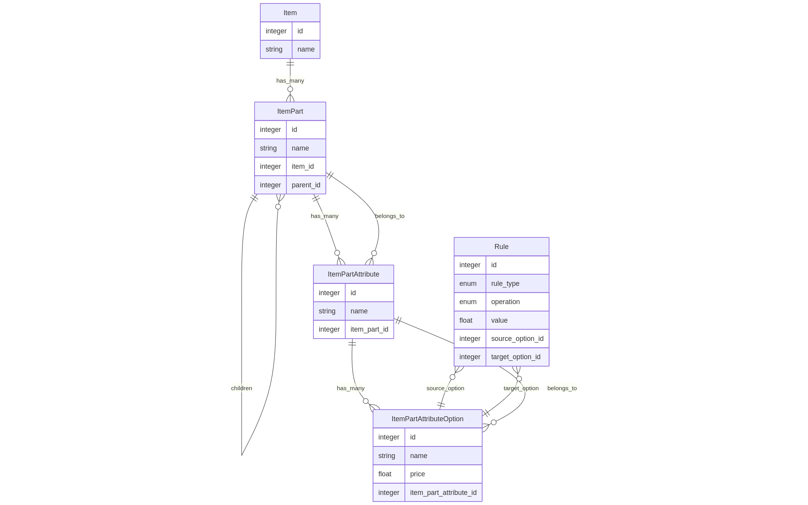

# 🚴 Marcus Shop – Custom Product Platform

## 🧠 Abstract

This project details the analysis and implementation of a scalable environment for product customization, based on a collection of existing options. Each option may behave differently depending on other selections via a set of predefined rules.

To support a consistent and flexible structure, the product (defined as `Item`) follows a 4-level entity hierarchy:
- **Item**
- **Part**
- **Attribute**
- **Option**

In addition, **parts** support **parent-child** relations, enabling nested customization. 

A fifth entity, **Rule**, relates two options (source & target) and defines:
- `Incompatibility`
- `Single-Compatibility`
- `Price Override`

**Assumption**: Most options are compatible by default, so we store incompatibilities explicitly to reduce redundancy.

**Stack**:
- Frontend: React
- Backend: Ruby on Rails (GraphQL API)
- DB: PostgreSQL

The interface includes:
- **Product Configurator** (customer-facing)
- **Back Office** (management of items, parts, attributes, options, rules)

---

## 📌 Overview

Marcus, a bicycle shop owner, wants to sell customizable bikes online. Customers can mix and match parts (frames, wheels, chains) with:
- **Real-time price updates**
- **Dynamic rules**
- **Out-of-stock management**

The system is designed to **scale** to support new product types (e.g., skis, surfboards).

---

## ⚙️ Constraints

### 1. Product Customization Rules
- Some part combinations are restricted:
  - Mountain wheels → only with full-suspension frame
  - Fat bike wheels ❌ red rims

### 2. Inventory Management
- Options can be marked as "out of stock"

### 3. Dynamic Pricing
- Prices depend on combinations:
  - Matte finish costs vary by frame type

### 4. Scalability & Flexibility
- Future support for new product types and deeper hierarchies

---

## 🧩 Assumptions

### 🔒 Strong Assumptions
- Most options are compatible
- Incompatibilities are reciprocal
- Exclusive compatibilities are *not necessarily* reciprocal
- Parts may have hierarchical relationships
- Lowest-level parts must have attributes
- Configured item is the "product" (not necessarily parts)

### 🧪 Flexible Assumptions
- Part hierarchies: max 3 levels
- One option per attribute (future: allow multiple)
- Rules: 2-condition (A → B). Future: (A & B → C)
- Conditions between options (future: option ↔ part)
- All attributes must be selected for checkout
- User selection may become non-progressive
- ‘Product’ term is intentionally avoided

---

## 🧱 Strategy

### Product Structure

Entity hierarchy:
- **Item**: The complete product (e.g., bike)  
  - **Part**: Components of the item (e.g., frame, wheels)  
    - Supports child parts (e.g., wheel → tire)  
    - **Attribute**: Properties of a part (e.g., color, type)  
      - **Option**: Selectable values for each attribute (e.g., red, matte)
- **Rule**: Links between two options, defining:
  - Incompatibility
  - Single-compatibility
  - Price override

**DB**

## 🛠️ Development

*(general infraestructure  image )*

### 🔙 Backend

Built with Ruby on Rails and GraphQL.

**Components**:
- Models
- Types
- Resolvers
- Mutations
- Tests (RSpec + FactoryBot)

**Basic Setup**:
- Enable CORS for React (port `5173`)
- GraphQL 2.5 minimal configuration
- Additional Gems: `rspec-rails`, `factory_bot_rails`

**Architecture**:
- `Item`: retrieves top-level parts (`parent_id` is null)
- `ItemPart`: retrieves its own child parts (recursive tree)
- `ItemPartAttribute`: standard ActiveRecord model
- `AttributeOption`:
  - Retrieves rules where option is **source** or **target**
  - Avoids front-end complexity when handling option relations
- `Rule`: validates logic depending on rule type

#### GraphQL Patterns

- `Create`: expects full parameters + parent component ID
- `Update`: uses component ID + parameters
- `Delete`: only needs the ID

#### Encapsulated vs Separated Inputs

- Most mutations use separated parameters
- AttributeOption `create/update` use encapsulated input due to multiple related params

#### Option Manages Rules

- Rules are handled within `Option` mutations
- Updating an option:
  - Deletes rules where option is **source**
  - Deletes **reciprocal** rules where option is **target**
  - New rules are created based on input

### 📊 Backend Architecture

*(backend architecture image )*

---

### 🖥️ Frontend

Built with React, split into two flows:
- **Product Configuration** (customer-facing)
- **Back Office** (admin-only)

#### Product Configuration

Flow to assemble a product with real-time updates.

##### Components

- **Item Configurator**:
  - Holds selected options
  - Applies `single-compatibility` rules
  - Calculates final price
  - Checks if all required options are selected

- **Part Section**:
  - Manages child parts recursively
  - Groups all attributes under a part

- **Attribute Block**:
  - Core logic for option selection
  - Evaluates whether each option is:
    - `Incompatible`
    - `Blocked by Compatibility`
    - `Blocked by Previous Selection (that defines an exclusive compatibility)`
    - `Out of Stock`

- **Option Selector**:
  - Renders UI for selectable options
  - Displays tooltips with rule info (currently verbose for testing)
  - Triggers selection changes

#### 🧭 Product Configuration Workflow

*(frontend workflow image)*

---

#### Back Office

CRUD UI for all entities.

- **ItemForm**
- **ItemPartForm**
- **AttributeList** & **AttributeForm**
- **OptionList** & **OptionForm**
- **RuleList**

Each form allows create, edit, and delete actions. Option forms include rule management for simplicity.

---

## 🔮 Further Work

Enhancements planned:

- 🌐 Multi-language support
- 🚨 Alerts & validation messages
- 🔁 Multiple options per attribute
- 🔄 N-conditional rules (e.g., `if A & B → not C`)
- 🔗 Option ↔ Part conditions
- 🧩 Option categories/properties (e.g., brand, provider)
- 🧠 Compatibility based on shared properties

---

## ✅ Conclusions

This project provides a robust foundation for customizable product sales, focused on scalability, flexibility, and clarity. With a modular backend and reusable frontend..